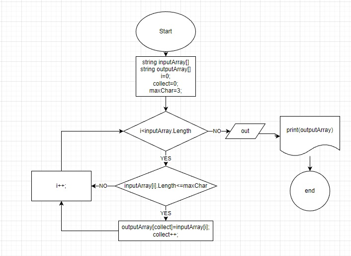

# [Ссылка на задание](https://gbcdn.mrgcdn.ru/uploads/asset/4283449/attachment/1251e74b703108ee483caaa98787097d.png)

## Алгоритм
1. Начало
2. Объявить исходный массив строк () 
3. Объявить массив из строк длина которых меньше или равно 3 символа (новый массив). 
4. Инициализировать переменные: 
>i // индекс элемента исходного массива

>collect // индекс элемента нового массива

>maxChar // длина строки

5. Объявить цикл, обявить условную конструкцию (пока i меньше длины исходного массива в теле цикла проверям, длину строки элемента массива. Если длина строки <=3 (maxChar<=3), то присваиваем это значение элементу нового массива, далее увеличиваем индекс collect на +1; индекс i, так же увеличивается на +1. Если длина строки >3, условие не выполняется, "идем" (минуя присвоение элемента и увлеичения индекса collect++) на индекс i, увеличиваем на +1.)
6. При не выполнении условия цикла, осуществляем выход.
7. Печатаем массив
8. Конец

